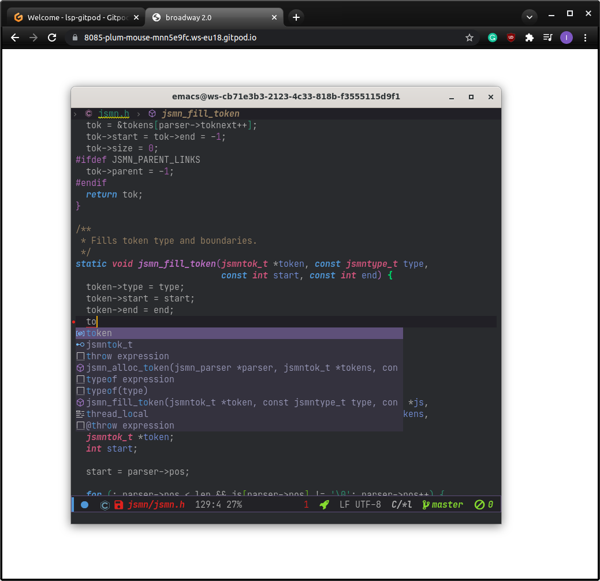

[](https://gitpod.io/#ORG=emacs-lsp,PROJECT=demo-projects,PROFILE=vanilla/https://github.com/emacs-lsp/lsp-gitpod)

# One-click Emacs web IDE (beta)

## Quickstart

Open the following url:

```
https://gitpod.io/#ORG=emacs-lsp,PROJECT=demo-projects,PROFILE=vanilla/https://github.com/emacs-lsp/lsp-gitpod
```

You can replace `PROJECT` and `URL` with any `github` project. Once you login you will see `VScode` editor and after a separate browser tab will pop up with Emacs in it(if you have your popups disabled, you can prefix the `VScode` url with `8085-` but make sure you keep the `VScode` tab open).

## Features
- Fully preconfigured ready-to-code Emacs Based IDE. There are several preconfigured
 - `Vanilla`
 - `Spacemacs`
 - `Doom` (TBA)
 - Your custom config (TBA)
- The following servers are preinstalled on the image(more to come):
 - `jdtls`
 - `ts-ls`
 - `eslint`
 - `json-ls`
 - `xmlls`
 - `html-ls`
 - `rust-analyzer`
 - `css-ls`
 - `clojure-lsp`

## Tips

* To avoid browser - Emacs key collisions you can use [Nyxt](https://github.com/atlas-engineer/nyxt) browser with `application-mode` enabled

## Limitations

* VScode tab has to be kept open and you have to click every 30 minute on it to keep the session open. This issue will be sorted out with gitpod team.
* Clipboard is not shared - this is GTK Broadway bug.
